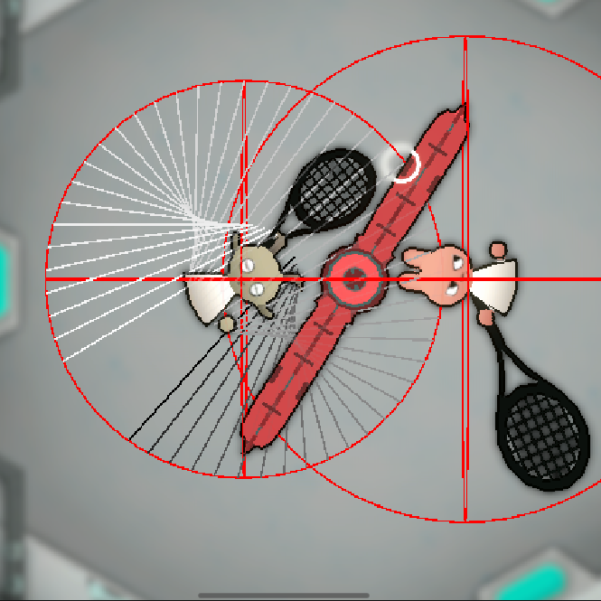
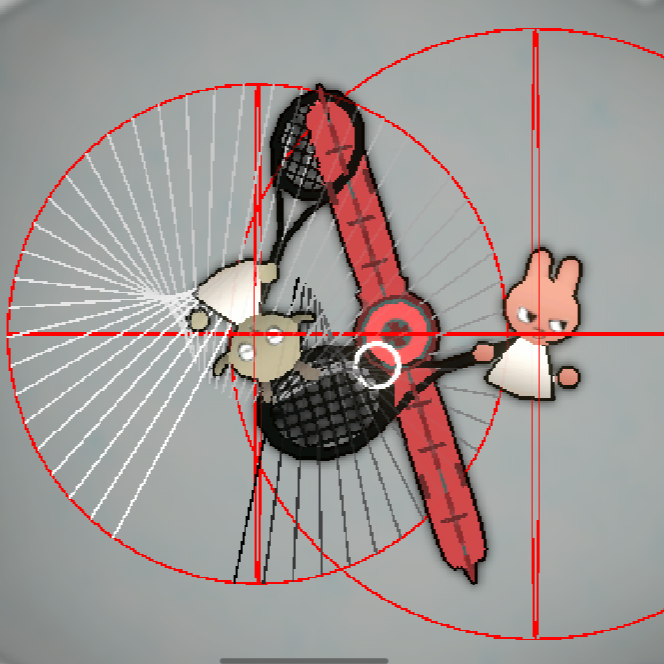

## Goal

The game project Fluffy Floaty Rubber Tennis is a physic-based fixed-Camera space tennis game. The only player control is to **Swing** the racket. 

The logic I chose for the interaction between the racket and other objects when swinging is to apply a force to the object the racket hit and a reaction force to the player.

## Why NOT Physics.SphereCast?

So.. why not just use the built-in Unity physics function `Physics.SphereCast`?

Maybe I just don't understand the real logic behind it, but I think it's bugged when the hit distance euqals to 0. 

As shown in the screenshot below, when the player swings toward left, the sphere cast starts at the character origin, and ends a little bit further than the racket. The expected collision point happens between "first spehre" of the Sphere Cast and the long obstacle on its right side. Since the sphere cast travels 0 distance to reach the obstacle, the hit distance is also expected to be 0.  



To this point, Everything makes sense to me. The reality is that the Sphere Cast returns a hit with hit distance as 0, as expected, however the hit point is at `Vector3.Zero`!

I did multiple tests and the result is consistent. As long as the hit distance is 0, the hit point is always `Vector3.Zero`... 

## Building a New Solution

Since the built-in function is not working as expected, I decided to build my own solution, using `Physics.Raycast`.

The mechanism is really based on the need of this project: swing a racket.

### Intuitivity

Breaking down the problem, these are the key points to make a swing intuitive:

- A comfortable swing should include a small circle space around the character, so when the ball is overlapping with the player, the player should be able to hit it.
- The swing should be the shape of a sector, because swinging is essentially rotating the arm to make the racket cover a sector area. 
- The swing should hit the object which is closest to the aim direction or the mouse position first.

Therefore, the hitting area should be covered like this:



### Mechanism

As shown above, the idea is to draw two concentric circles, then draw two lines through the center of the circle to determine the sector angle, Then connect the hitting points to form a sector area with a smoothed central angle.

The parameters are:
1. The radius of the overlapping circle.
2. The radius of the circle in which the sector lies. (Distance of how far the racket can reach when swinging)
3. The angle of the sector.

### Ray Casting

Then we can cast rays from the small circle to the big circle with a defined ray desity. In this project, I



### Ray Sorting

As mentioned in the Intuitivity section, the ray should be sorted/culled to let the player hits what they want to hit.

Say the player is aiming toward right and the green circle overlapping the hitting area is a ball. The default behaviour without any sorting is quite random. For example, in the shown image, the rays can be casting from bottom to top, top to bottom or even from middle to the edge.



  

In this case, I decided to add three sorting methods:

1. **Distance Sorting**: Sort the rays based on the distance to the center of the sector.

2. **Angle Sorting**: Sort the rays based on the angle between the ray and the aiming direction.

3. **First/Last Hit Sorting**: Sort the rays based on the order that rays are casted.

## Implementation

After some debugging, the result is quite good, at least gameplay wise.

Here is a full comparison of different sorting methods:

    

        
        
Fist Hit

    

    

        
        
Last Hit

    

    

        
        
Min Distance

    

    

        
        
Max Distance

    

    

        
        
Min Angle

    

    

        
        
Max Angle

    

## Want to see the work in the game?
Try the game yourself for free!

<iframe frameborder="0" src="https://itch.io/embed/2707388?bg_color=ffffff&amp;fg_color=2d2d2d&amp;link_color=ea5858&amp;border_color=cccccc" width="552" height="167"><a href="https://secondrealmstudio.itch.io/ffrt">Fluffy Floaty Rubber Tennis by Second Realm Studio, Charlotte Crosland, Yyuk1, Wonderboiz, Rina, sky-haihai</a></iframe>