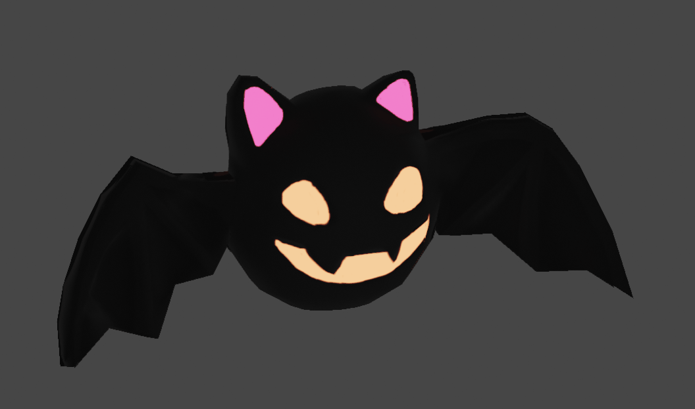

## Introduction

In my last post I started learning Mozilla Hubs by creating a demo scene. In this post I'm going to talk about the avator system in Hubs.

## Demo

Here's a demo avator I made during my study:

https://0827133699.us1.myhubs.net/avatars/oJpqzhA

#### Features

It has following features:

1. Idle animation
2. Head tracking
3. Lip syncing (User audio input feedback)
4. Personal space invader (other avators will be transparent or disappear when the user is too close to them)

It doesn't have:

1. Walking animation
2. Hand-up pose
3. Eye tracking (for VR users)
4. Hand tracking (for VR users)

You can access my demo avator and use it as your own avator from this [Link](https://0827133699.us1.myhubs.net/avatars/oJpqzhA)

## Limitations

Limitations for avators are similar to the limitations for scenes:

1.  No support for custom shaders (Only one fixed PBR shader)
1.  No support for texture filters
1.  No production level support for post-processing (Only Experimental)
1.  Alpha blending is a still pain therefore I have to try to avoid it as much as possible in designing phase

## Character Workflow

Unlike there is only one option, Blender, for scene creation, avator can be created using any DCC sofware, at least theoretically. However since I have been using Blender for more than 5k hours, I'm going to stick with Blender for avator creation.

### Modelling, UV Mapping

Modelling doesn't have any guideline from Hubs Documents, but it's good to keep the polygon count low. Here's a little bat I made for my demo avator:



### Texturing, Rendering

When it comes to texturing, although Hubs doesn't have any naming convension for textures, one thing to keep in mind is that Hubs only support PBR(Physical-Based-Rendering) workflow, which means the textures should be created based on PBR workflow. Here's a list of types of textures Hubs supports:

#### 1. Albedo Map(Color Map)

Alpha channel is supported but not suggested because it's expensive and not handled very well by Hubs when there is a huge amount of participants in the scene.


#### 2. Normal Map



#### 3. Emission Map

Emission Map tells the renderer which part of the model should be self-illuminated. It's not very important for Hubs now because post-processing is still experimental, but it's still good to have one in case the post-processing is implemented in the future official Hubs build or if you are using a custom build of Hubs.


#### 4. ORM Map (Occlusion, Roughness, Metallic)

Each channel of the texture is used for different purpose:
R: Occlusion
G: Roughness
B: Metallic

Since the browser renderer for Hubs uses a simplified PBR workflow, ORM map would only make a very subtle change of the visual quality of the avator, therefore, in my demo avator I decided to ignore this map for now.

### Material

There's a function in Hubs called remixing, which allows users to change the texture of an existing avator. However, remixing will only affect the first material in the model, threfore, it's important to keep the number of materials single. Here's a screenshot of the material setup of my demo avator:



### Rigging

There is a very strict naming convension for bones. The best practice is to download the sample avator from [Hubs Github Repo](https://github.com/MozillaReality/hubs-avatar-pipelines/tree/master/Blender/AvatarBot) and use it as a starting point. From there, import your own model and rig it using the same bone structure. Additional bones are allowed while built-in bones is needed for the avator to be correctly setup inside Hubs. Here's a screenshot of the bone structure of my avator:



### Animation

First thing to keep in mind when making animations is that all animations is handled using the Hubs Blender Exporter Addon, there are two type of animations:

1. Loop Animation: used for idle animation, Walking animation, etc.
2. UV Scroll: used for flip-book animation, e.g. lip syncing, blinking, face expression, etc.

### Shape Keys

Shape keys are supported just make sure to include them when exporting as a GLB/GLTF file.

### Hubs Components

Each [Feature](#features) I mentioned above is implemented using Hubs Components. Here's a list of components I used in my demo avator:

#### 1. Loop Animation Component for idle animation



#### 2. Head tracking

Head tracking is handled automatically by Hubs, no need to add any component for it. The only thing artists have to make sure is the head bone's name is set to "Head"

#### 3. Lip syncing

There are two types of components used for lip syncing, one is for shape key animation to simulate the mouth movement



The other one is for a simple scale change to give other user a sense of volume change when the user is speaking



#### 4. Personal space invader



### Exporting

Here's my setting when exporting my avator, the setting may vary depending on your model, for instance, if you don't have any shape keys, you can uncheck the "Export Shape Keys" option to potentially reduce the size of the final GLB file.




## Copy Right

Accroding to the [Terms of Service](https://hubs.mozilla.com/terms.html), all the content uploaded to Hubs is licensed under [CC BY-SA 4.0](https://creativecommons.org/licenses/by-sa/4.0/). This means that if you are using a model that is not created by yourself, you should make sure that the model is licensed under CC BY-SA 4.0 or similar license and make sure to give proper credits to the creators.

## References

Mozilla. Advanced Avatar Customization. Hubs Documentation.  
https://hubs.mozilla.com/docs/creators-advanced-avatar-customization.html
